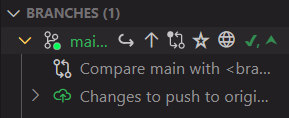
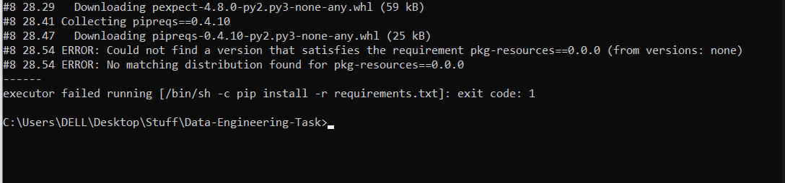
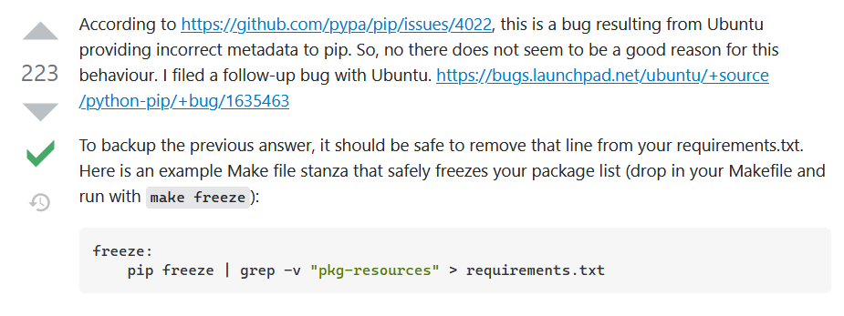
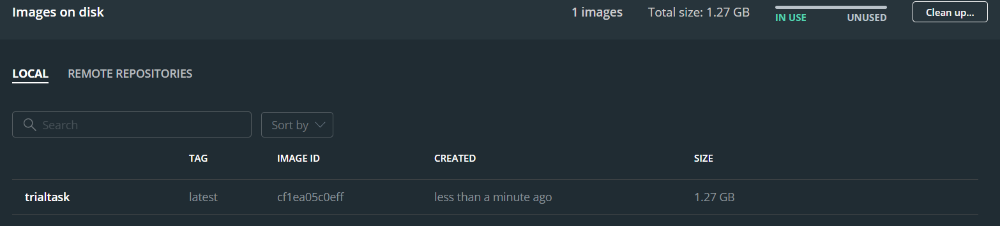
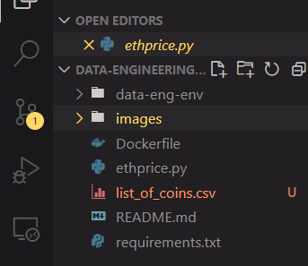
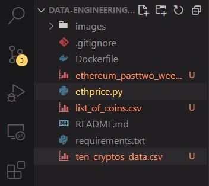

# Data Engineering Task

## Contents

- [Introduction](#intro)
    - [Instructions for Use](#usage)
- [Walkthrough of this Task](#walk)
    - [Setting up the Environment](#setup)
    - [Extracting Data from CoinGecko](#extract)
        - [Minor Bug](#bug)
        - [Building the Dockerfile and Running the Container](#dockrun)
    - [Getting More Data](#more)
- [Conclusion](#conc)

## Introduction

This is a data engineering task to extract the 10 latest prices for the 
cryptocurrency Ethereum, from CoinGecko's public API. I will be using the 
Python wrapper for CoinGecko's API, provided on their
[GitHub page](https://github.com/man-c/pycoingecko). However, I ended up not
using the Python wrapper.

The Python script sends GET requests based on the APIs on CoinGecko, converts
the JSON responses into a Pandas dataframe, performs some transformations on 
the data (such as renaming columns and converting Unix timestamp to datetime), 
and writes the dataframe as a CSV into the local host. This process is written 
in a Dockerfile, which can be built and ran using Docker, and upon doing that, 
outputs three CSV files into the user's machine.

The `list_of_coins.csv` cointains the ID, name and symbol of all the 
cryptocurrencies listed on CoinGecko, the `ten_cryptos_data.csv` contains the 
current price and details of 10 example cryptocurrencies including Ethereum, 
and the `ethereum_pasttwo_weeks.csv` file contains the OHLC 
(open-high-low-close or candlestick data) data of only Ethereum in the past two 
weeks, with a granularity of 4 hours.

### Instructions for Use

If you have Git installed, you can navigate to a folder where you want to place
 the files, and clone this repository by typing into the terminal:

    git clone https://github.com/ismaildawoodjee/Data-Engineering-Task

Otherwise, you can download the ZIP file and unzip it in the current directory 
of your choice. Yet another way would be to use VS Code and clone the 
repository with one click.

Once that is done, ensure that you have Docker installed by typing:

    docker --version

If you don't have Docker, install it from this 
[website](https://docs.docker.com/docker-for-windows/install/), assuming that 
you are on windows. Open Docker Desktop and go back to your terminal.

The next step is to build a Docker image from the Dockerfile by typing:

    docker build -t name_of_your_image .

In my case, I typed `docker build -t trialtask .`. The `-t` flag stands for 
"tag", which tags my image with the name "trialtask". The dot `.` at the end 
indicates that the Dockerfile is located in the current directory that I am in. 
Building the image may take a few minutes. For me, it took about 7-8 minutes 
for the first build.

Once the image has been built, go to the Images tab on Docker Desktop to see 
your new image with the given name. It is currently not running yet. To create 
a container from this image and run it, type:

    docker run -v directory\for\saving\your\files:/app/data name_of_your_image

This run command mounts a volume driver so that the data that was created 
inside the container at `/app/data` gets written into the 
`directory\for\saving\your\files`. In my case, I typed 
`docker run -v C:\Users\DELL\Desktop\Stuff\Data-Engineering-Task:/app/data 
trialtask`, which ran successfully and produced three CSV files as expected.

## Walkthrough of this Task

### Setting up the Environment

The first thing I did was to create a new folder in my local machine (Linux 
OS), and initialize a Git repository using `git init`. After that, I checked my
Python version using `python3 --version`. It wasn't the latest version (it was 
3.8.5), so I installed the latest version following the instructions from this 
[website](https://linuxize.com/post/how-to-install-python-3-9-on-ubuntu-20-04/)
, and then set up a virtual environment using `python3.9 -m venv data-eng-env`.
I was already inside the repo that I created, so before doing anything, I 
activated the venv using `source data-eng-env/bin/activate`. Next, I created a
README.md file using `touch README.md` and wrote the title of this project 
there. To ensure that I am inside the venv, I can use `env | grep VIRTUAL_ENV`,
by piping grep with env, and checking that I am in the correct virtual environment.

Now, I want to track all the changes I made since the initialization. I stage 
all the changes using `git add .` and make a commit by writing `git commit -m 
"First commit; created venv and README"`. But before pushing my changes, I will 
need a GitHub repo first. I am using VS Code with the source control extension, 
so I simply create a new repository with the name "Data-Engineering-Task" from 
the "Branches" tab (after signing in with my GitHub account). Once created, it 
automatically pushes the changes to the new repo. Finally, I install 
CoinGecko's Python wrapper and create a new Python script using `touch 
ethprice.py`. I write these steps in the README file and push the new changes 
to my repo using `git push origin main` (I already configured my GitHub to use 
`main` instead of `master` as the default branch).

I am ready to start writing the Python script.

### Extracting Data from CoinGecko

First, I try to understand the APIs given in the 
[CoinGecko API page](https://www.coingecko.com/api/documentations/v3), pinging 
the API server to test it out. It works when it gives a 200 status code, which 
it does. Also, I was going to use the Python wrapper, then I realized it might 
be better to just use `requests` where I can specify the parameters more 
easily.

Next, I want to test out the `simple/price` request since it provides the 
current price of a crypto in terms of other currencies/cryptos while also 
including the 24h change and last update time. However, I don't know what the 
ID for Ethereum is, so I will need to look at the `coins/list` request to see 
the specific ID for Ethereum. To do this, I wrote a couple of functions to 
print out the data and put it into a Pandas dataframe. The ID for Ethereum 
turned out to be `ethereum` and there are over 7600 coins listed on CoinGecko.

Before going any further with data collection, I want to write the `coins_df` 
list of coins dataframe as a CSV file into my system, create a 
`requirements.txt` and Dockerize the script so that anyone can run it on their 
own local machine. However, this proved to be more complicated than I expected.

#### Minor Bug

In my Ubuntu laptop, I created the `requirements.txt` file using 
`pip freeze > requirements.txt` because surprisingly, in contradiction to the 
info given [here](https://stackoverflow.com/questions/31684375/automatically-create-requirements-txt), 
using `pipreqs` resulted in generating over 100 dependencies but `pip freeze` 
generated much less. I also created a Dockerfile according to the 
[instructions](https://www.freecodecamp.org/news/docker-101-fundamentals-and-practice-edb047b71a51/)
, using a Python 3.9.5 image, telling Docker to install the dependencies from 
`requirements.txt` and running the Python script.

However there was a 
[bug](https://stackoverflow.com/questions/39577984/what-is-pkg-resources-0-0-0-in-output-of-pip-freeze-command) 
that occurs within Python virtual envs created in Ubuntu.

I only found out about this after building the Docker file in my Windows 
laptop, to test if my script works on Windows.

In this case, I fixed the bug by excluding the line containing `pkg-resources` 
from `pip freeze`, following the accepted answer in Stackoverflow:

    pip freeze | grep -v "pkg-resources" > requirements.txt

The `grep` command with the `-v` flag excludes the line containing 
`pkg-resources` from appearing in the `requirements.txt` file, so it will no 
longer be installed as a dependency.

#### Building the Dockerfile and Running the Container

After fixing this bug, I went back to my Windows machine, cloned the latest 
repo and successfully built the Dockerfile using `docker build -t trialtask .`.

However, just using `docker run trialtask` did not produce the CSV output that 
I expected. It took me some digging around to find out that I needed to mount a 
file drive, so that the CSV that is produced by running the container is also 
outputted into my local machine. According to a post from 
[here](https://phoenixnap.com/kb/docker-run-command-with-examples), Docker 
containers remove all the data they produce after they stop running. The 
solution is to mount a volume from your local host and write the CSV file into 
a separate folder `/data` that won't get destroyed after the container stops 
running. In my case, instead of running `docker run trialtask`, I needed to run

    docker run -v C:\Users\DELL\Desktop\Stuff\Data-Engineering-Task:/app/data trialtask

I also modified the Dockerfile to create a `/data` directory for this purpose. 
Running the above command successfully outputted the CSV file that I wanted 
into my local machine (and I deleted it afterwards).

### Getting More Data

Now that I have a CSV file about the names, symbols and IDs of all the coins 
listed on CoinGecko, I can get the latest/current price of all of these cryptos
 (not only Ethereum) using the `/simple/price` GET request provided on the API 
 page. Unfortunately, passing in all the coin IDs by looping over them gave a 
 JSONDecodeError, with the program complaining that nothing was returned by the 
 server when something was expected. After Stackoverflowing around, I suspect 
 that most of the 7600 coins might be so obscure that there may not be enough 
 data about their 24hr change in price or last update time or etc., resulting 
 in empty responses to my requests.

No problem. I don't need the details of all 7000 irrelevant cryptos anyway. I 
make a list of 10 easy to spell cryptos and get their details into a dataframe, 
sorting them by market cap, converting from Unix timestamps to datetime and 
outputting the result as a CSV file.

Finally, I want to get historical time-dependent data about Ethereum only. I 
can do this using the OHLC GET request, by specifying the coin ID, the currency 
to measure against (US$) and the number of days into the past, which I 
specified as 14 days. This provides me with candlestick data about Ethereum in 
intervals of 4 hours, so that I collected the latest 84 instances of Ethereum 
price. One minor problem was that the Unix timestamp data provided by the API 
was mistakenly multiplied by 1000, which I discovered when converting timestamp 
to datetime and got an error saying Year 54000 does not exist, or something 
along those lines. Dealing with this was straightforward: just divide the 
timestamps by 1000 before converting.

### Conclusion

In this project, I wanted to extract the latest 10 prices of the cryptocurrency
Ethereum, from the public API provided by CoinGecko. There wasn't an official
GET request that provided both the 10 historical prices and all the details
that come with the `/simple/price` GET request, so I obtained the OHLC data
for Ethereum and opted to extract the details of 10 different cryptos instead,
along with a list of all coins listed on CoinGecko. 

Building the Docker image and then running the Docker container for this
project should output the 3 datasets mentioned above. This was successful both
on my Linux and Windows PCs and produced 3 CSV files as expected. One final 
improvement that I could have done was to explore more Docker in terms of 
writing a Docker-Compose file, although it might not be needed for such a
simple Docker file. 

